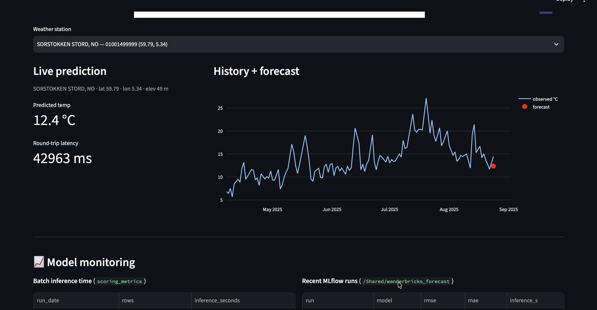
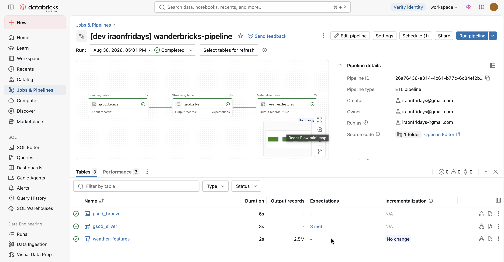
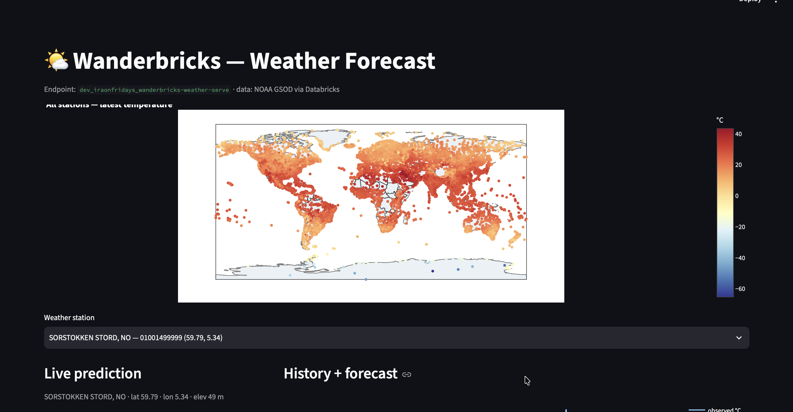
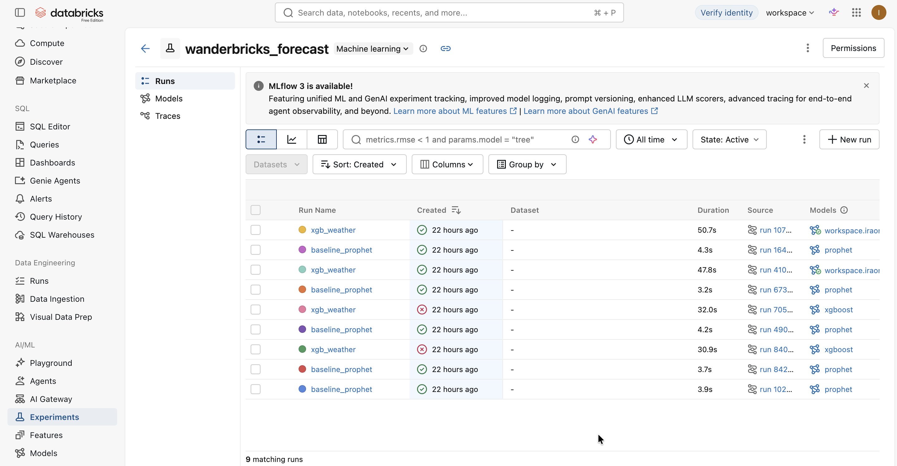

# Wanderbricks

**End-to-end Databricks data + ML/AI engineering** for **daily weather forecasting**
from the public **NOAA GSOD** dataset. Project-as-code with the Databricks CLI
(Declarative Automation Bundles): Delta Live Tables for the data layer, MLflow
for tracking and the model registry, Databricks Jobs for orchestration, and a
live Model Serving endpoint.

> **Status: LIVE in dev** — the full chain has run end to end: pipeline → model →
> serving. See [Status](#status).

---

## Status

| Stage | Result |
| --- | --- |
| DLT pipeline (bronze → silver → gold) | ✅ real °C data, quality gates |
| Prophet baseline | ✅ MLflow-tracked |
| XGBoost train | ✅ registered `wanderbricks_weather_xgb` → `@Production` |
| Batch scoring | ✅ 11,329 station forecasts in 0.049 s |
| Model serving endpoint | ✅ live — tested `{"predictions": [23.86]}` |
| Notebooks | ✅ run in the workspace **and** locally (Databricks Connect) |

---

## Architecture

```
s3://noaa-gsod-pds/ (public GSOD daily weather)
   │  Auto Loader (streaming read, incremental)
   ▼
gsod_bronze   (raw, full 28-col schema)        ── DLT streaming table
   │  DLT clean: @dlt.expect_or_drop, °F→°C, in→mm, sentinels → NULL
   ▼
gsod_silver   (metric, validated)              ── DLT streaming table
   │  DLT features: calendar + lags + rolling
   ▼
weather_features (gold)                        ── materialized view
   │
   ├──► Prophet baseline ───────────┐
   └──► XGBoost ── MLflow ── Model Registry (@Production alias)
                                       ├──► batch scoring → forecasts table
                                       └──► Model Serving endpoint (REST)
```

All deployed and runnable from the bundle: one DLT pipeline plus one daily job
(`dlt_pipeline → baseline → train → score`).

---

## Screenshots

### Streamlit Frontend App


### DLT Data Pipeline


### Geospatial Map


### Model Monitoring


---

## Quickstart

### Prerequisites

- A Databricks workspace (this project targets **serverless compute** — the
  workspace is serverless-only)
- macOS/Linux with Homebrew and [uv](https://docs.astral.sh/uv/)
- Python 3.12+

### 1. Install and authenticate the Databricks CLI

```sh
brew install databricks/tap/databricks
databricks --version                       # 1.x
databricks auth login --host https://dbc-2944edfb-cd25.cloud.databricks.com
# or use a named profile: ~/.databrickscfg
```

### 2. Install project dependencies

```sh
cd ~/databricks-forecasting
uv sync                                   # databricks-connect, databricks-sdk,
                                          # mlflow, prophet, xgboost, nbconvert, ...
```

### 3. Deploy the bundle

```sh
databricks bundle validate --target dev
databricks bundle deploy --target dev     # DLT pipeline + job + serving endpoint
```

### 4. Run the data pipeline

```sh
databricks bundle run wanderbricks_pipeline --refresh-all
# bronze → silver → gold, picks up new GSOD days since the last run
```

### 5. Run the ML job

```sh
databricks bundle run wanderbricks_job --refresh-all
# dlt_pipeline → baseline (Prophet) → train (XGBoost) → score (batch forecasts)
```

### 6. Explore in notebooks

In the **workspace**: open `/Users/<you>/wanderbricks/notebooks/`
(`01_explore_bronze_silver`, `02_explore_features`, `03_quick_forecast`,
`04_test_serving`).

**Locally** (same notebooks, Databricks Connect):

```sh
uv run jupyter notebook notebooks/        # or: uv run jupyter lab
```

The notebooks self-bootstrap: workspace-native `spark`/`dbutils` in the UI,
Databricks Connect + SDK emulation locally (profile `irajput`), with a guarded
widget helper so every cell runs in both modes.

---

## Serving the model

Endpoint names (dev resources get the `dev_<user>_` prefix):

| Target | Endpoint |
| --- | --- |
| dev | `dev_iraonfridays_wanderbricks-weather-serve` |
| prod | `wanderbricks-weather-serve` |

### Test with curl (token auth)

Save the request payload to `data.json` (already in this repo — a realistic
feature row from `weather_features`):

```json
{
  "dataframe_records": [
    {
      "day_of_week": 3, "day_of_year": 200, "month": 7, "is_weekend": 0,
      "temp_lag_1": 24.5, "temp_lag_7": 22.1, "temp_lag_14": 20.3,
      "temp_lag_28": 18.7, "temp_rollmean_7": 23.2, "temp_rollmean_14": 22.4
    }
  ]
}
```

```sh
DATABRICKS_TOKEN=$(databricks auth token | jq -r '.access_token')

curl -u token:$DATABRICKS_TOKEN \
  -X POST \
  -H "Content-Type: application/json" \
  -d@data.json \
  https://dbc-2944edfb-cd25.cloud.databricks.com/serving-endpoints/dev_iraonfridays_wanderbricks-weather-serve/invocations
```

Expected: `{"predictions": [23.86]}` (a temperature in °C).

### Alternatives

- **Bearer auth:** `-H "Authorization: Bearer $DATABRICKS_TOKEN"` instead of `-u`.
- **In-workspace:** `notebooks/04_test_serving` builds the payload from the real
  feature table and prints the round-trip time.
- **UI:** the endpoint page has a built-in "Query endpoint" playground; its
  Metrics tab shows p50/p95/p99 latency.

---

## Project structure

```
databricks-forecasting/
├── README.md                ← this file (start here)
├── INFORMATION.md           ← Databricks feature tour + full project procedure
├── databricks.yml           ← bundle: targets (dev/prod), resources
├── data.json                ← sample serving request payload
├── pipelines/               ← DLT data layer
│   ├── 01_ingest.py         ← Auto Loader → bronze
│   ├── 02_clean.py          ← quality gates + unit conversion → silver
│   └── 03_features.py       ← lags + rolling → gold
├── ml/                      ← ML layer (job tasks)
│   ├── 04_baseline.py       ← Prophet, MLflow-tracked
│   ├── 05_train_xgb.py      ← XGBoost → model registry + @Production
│   └── 06_score.py          ← batch scoring + inference-time monitoring
├── monitoring/
│   └── monitors.sql         ← Lakehouse Monitoring statements
├── notebooks/               ← exploration/lab notebooks (workspace + local)
├── resources/
│   ├── wanderbricks_pipeline.pipeline.yml
│   ├── wanderbricks_job.job.yml
│   └── wanderbricks_serving.endpoint.yml
└── docs/
    ├── development-log.md   ← running timeline of every step
    └── decisions.md         ← ADR-style decision records (D1–D17)
```

---

## Monitoring & observability

- **Pipeline flow:** job run page (task DAG) and DLT pipeline UI; CLI via
  `databricks jobs get-run`.
- **Batch inference time:** `scoring_metrics` Delta table
  (`run_date, rows, inference_seconds`) + MLflow `inference_seconds` metric.
- **Serving latency:** endpoint Metrics tab (p50/p95/p99, requests/sec).
- **Data quality / drift:** `monitoring/monitors.sql` (Lakehouse Monitoring).
- **Datadog (optional):** workspace Settings → Datadog integration exports job,
  cluster, DBU, and serving metrics.

---

## Documentation & learning

- **`INFORMATION.md`** — the full Databricks feature tour (14 features with
  examples) and the end-to-end project procedure, including the batch-vs-streaming
  decision and GSOD data facts.
- **`docs/development-log.md`** — what happened, step by step.
- **`docs/decisions.md`** — why every choice was made (D1–D17: serverless,
  triggered-vs-continuous, unit fixes, UC signatures/aliases, dev-name prefix…).
- **`docs/production-challenges-and-interview-prep.md`** — comprehensive MLOps study guide for real-world scenarios and interview prep.

---

## Next steps

- [ ] Promote to prod (`databricks bundle deploy --target prod`)
- [ ] Retraining-on-drift task (compare forecast error vs threshold, retrain + promote)
- [ ] Datadog wiring
- [ ] Station-aware modeling (encode `station` or per-station models)
- [ ] Widen ingestion to full GSOD history (bucket root)

No credentials in the repo; auth lives in `~/.databrickscfg`.
